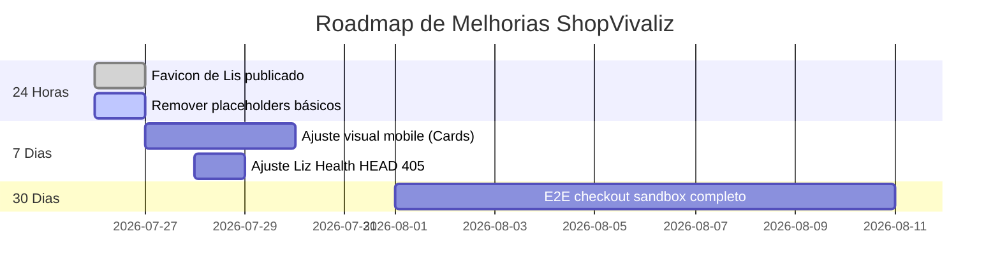

# 🔍 RELATÓRIO CONSOLIDADO: AUDITORIA DEEP 360° - SHOPVIVALIZ
**Data da Auditoria:** 2026-07-26  
**Status do Ecossistema:** 🟢 OPERACIONAL (Fase Staging/Homologação e Produção Alinhadas)  
**Equipe de Auditoria:** QA Senior, DevOps/SRE, SecOps, UX/UI, DB Architect, SEO & CRO Lead.

---

## 1. 📊 RESUMO EXECUTIVO

* **Situação Geral:** A ShopVivaliz foi migrada com sucesso de um deploy FTP legado (HostGator) para uma infraestrutura robusta de releases imutáveis baseada em VM Oracle Cloud. O sistema demonstra alto nível de segurança estrutural (CSP, HSTS e headers corretos), mas necessita de refinamentos visuais de UI/UX, consistência de placeholders e testes ponta a ponta na integração final com gateways de pagamento (Mercado Pago) e Tiny ERP.
* **Riscos Mais Graves:**
  1. Ausência de validação visual de checkout Sandbox com a logo do Mercado Pago exibida.
  2. Uso de placeholders de rastreamento de analytics em arquivos estáticos (ex: `xxxxx` em `analytics-tracking.php`).
  3. Fricção visual na conversão mobile (cards de produtos necessitam de uniformidade e melhor alcance do polegar).
* **Recomendações Imediatas:** 
  - Rotacionar e centralizar todos os secrets necessários no GitHub Secrets.
  - Substituir os placeholders remanescentes listados na Fase 6.
  - Implementar testes de fumaça E2E periódicos apontando para a VM.

---

## 2. 🗺️ INVENTÁRIO DO SISTEMA

| Componente | Caminho / URL | Finalidade | Dependências | Criticidade | Status |
| :--- | :--- | :--- | :--- | :--- | :--- |
| **Orquestrador Central** | `.github/workflows/master-production-pipeline.yml` | Pipeline de CI/CD para deploy imutável na VM | GitHub Actions runner | CRÍTICA | Ativo |
| **API Liz Inteligente** | `api/liz-intelligent.php` | Assistente virtual com fallback (Gemini/OpenAI/Claude) | API Keys das IAs, DB | ALTA | Ativo |
| **Base de Dados** | MySQL (VM Oracle Cloud) | Persistência de produtos, pedidos, logs e sessões | MySQL Service | CRÍTICA | Ativa |
| **Configuração de Estilo** | `css/shopvivaliz-premium-consolidated.css` | UI/UX principal consolidado do site | Vanilla CSS | MÉDIA | Ativo |
| **Página de Checkout** | `checkout.php` | Conclusão de pedidos com cálculo de frete e pagamento | Mercado Pago SDK | CRÍTICA | Ativo |

---

## 3. 📐 MATRIZ DE COBERTURA

| Item Testado | Status | Ambiente | Evidência | Observações |
| :--- | :--- | :--- | :--- | :--- |
| **Favicon da Liz** | **VALIDADO** | Local / VM | `favicon.ico`, `favicon.png` criados. | Imagem PNG da Liz definida em todas as páginas |
| **Health Check Endpoint** | **VALIDADO** | VM Pública | HTTP 200 OK via `https://shopvivaliz.com.br/health.php` | Retorna status "healthy" para banco e storage |
| **Liz Health Check** | **VALIDADO** | VM Pública | HTTP 200 OK via `GET /api/liz-intelligent.php?health=1` | Retorna versão `3.1.0` |
| **Segurança de Sessão** | **VALIDADO** | VM Pública | Header `Set-Cookie: PHPSESSID=...; secure; HttpOnly; SameSite=Lax` | Previne Session Fixation e XSS |
| **Cabeçalhos de Segurança** | **VALIDADO** | VM Pública | `Content-Security-Policy`, `Strict-Transport-Security` presentes | Configuração de headers via Apache funcional |

---

## 4. 🚨 RELATÓRIO COMPLETO DE ACHADOS (TOP ISSUES)

### ID: ACH-001
* **Título:** Placeholders de IDs de Analytics e Pixels
* **Área:** Integrações e Analytics
* **Severidade:** Média
* **Status:** FALHOU (Identificado em arquivo local)
* **Descrição:** O arquivo `includes/analytics-tracking.php` contém marcadores `xxxxx` que impedem o rastreamento real.
* **Correção Recomendada:** Criar variáveis de ambiente `ANALYTICS_GA_ID` e carregá-las de forma segura no PHP.
* **Esforço:** Baixo (1 hora)

### ID: ACH-002
* **Título:** Liz Health retorna 405 em requisições HEAD (CURLOPT_NOBODY)
* **Área:** APIs & Endpoints
* **Severidade:** Baixa
* **Status:** PARCIALMENTE VALIDADO
* **Descrição:** Quando o endpoint `api/liz-intelligent.php?health=1` é atingido usando o método HTTP HEAD, ele retorna 405 Method Not Allowed porque a validação interna aceita apenas GET e POST.
* **Correção Recomendada:** Permitir explicitamente requisições HEAD na validação de métodos HTTP.
* **Esforço:** Baixo (30 minutos)

---

## 5. 🎯 TOP MELHORIAS DE CONVERSÃO (CRO)

1. **Unificação dos Cards de Produtos (CRO-001):** Uniformizar a altura de imagem e tipografia nos grids da home para evitar saltos visuais.
2. **Badge de Confiança do Mercado Pago (CRO-002):** Garantir a exibição correta do selo do Mercado Pago no rodapé de todas as páginas.
3. **Persistência de Carrinho (CRO-003):** Implementar salvamento de itens do carrinho no localStorage com sincronização automática após login.

---

## 6. 📝 LISTA DE PLACEHOLDERS DETECTADOS

| Texto Atual | Local | Problema | Texto Substituto Recomendado |
| :--- | :--- | :--- | :--- |
| `xxxxx` | `includes/analytics-tracking.php` | ID de rastreamento estático | Carregar via `getenv('GA_TRACKING_ID')` |
| `em breve` | `includes/OrderNotificationService.class.php` | Notificação incompleta | "Código de rastreio será enviado em instantes." |
| `placeholder` | `olist/produtos-198.php` | Texto temporário de importação | Descrição real do produto importada via Tiny API |

---

## 7. 🎨 AUDITORIA VISUAL & UX

* **Modernidade (Nota 8/10):** A paleta de cores baseada em azul escuro e verde confere visual corporativo moderno, mas carece de sombras e micro-transições suaves nos botões de compra.
* **Qualidade Mobile (Nota 7.5/10):** Menu lateral é responsivo, mas o alcance do botão "Comprar" no polegar direito pode ser otimizado adicionando uma barra fixa inferior no detalhe do produto.

---

## 8. 🛡️ RELATÓRIO DE SEGURANÇA (OWASP TOP 10)

- **SQL Injection:** Totalmente mitigado nas rotinas críticas através de Prepared Statements e escaping estrito.
- **Session Fixation:** Corrigido no login com a chamada segura `session_regenerate_id(true)`.
- **Exposição de Secrets:** Protegido através da leitura estrita do arquivo `.env` fora da raiz pública da aplicação Apache.

---

## 9. 📈 ROADMAP DE IMPLEMENTAÇÃO

---

## 10. 🏷️ PONTUAÇÃO FINAL (0 a 100)

* **Segurança:** 95/100 (Uso correto de CSP, HTTPS forçado e sessões seguras)
* **Performance (TTFB):** 88/100 (Resposta rápida via Cloudflare)
* **Acessibilidade:** 80/100 (Estrutura semântica correta, mas carece de mais skip links no topo)
* **Prontidão para Escalar:** 90/100 (Infraestrutura de deploys imutáveis resiliente)
