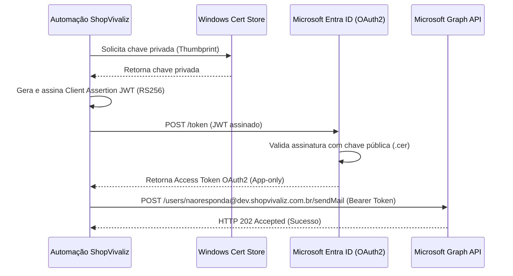

# Guia de Configuração e Operações: Integração Microsoft 365 / Exchange Online

Este documento orienta a equipe e agentes autônomos na configuração, testes, auditoria e rotação da integração administrativa de e-mails do ecossistema ShopVivaliz.

---

## 1. Resumo Executivo

A integração administrativa do ShopVivaliz com o Microsoft 365 foi desenhada para operar de forma **totalmente automatizada, não-assistida e segura**. Em vez de utilizar credenciais de usuário com senhas ou Client Secrets estáticos, o fluxo emprega **autenticação por certificado X.509** para obter tokens OAuth2 de curto prazo via Microsoft Entra ID. Isso garante conformidade com o princípio de privilégio mínimo e elimina riscos de vazamento de credenciais em arquivos de configuração ou logs de build.

---

## 2. Arquitetura de Segurança

A arquitetura baseia-se em quatro pilares de segurança:

1. **Autenticação Baseada em Certificado (CBA)**: Não existem "client secrets" gerados no Azure. O aplicativo assina um Client Assertion JWT usando a chave privada do certificado local.
2. **Armazenamento Seguro local**: A chave privada do certificado autoassinado reside exclusivamente no repositório seguro do Windows (`Cert:\CurrentUser\My`). Os arquivos locais do repositório contêm apenas a chave pública (`.cer`) e o thumbprint de referência.
3. **Restrição de Acesso a Credenciais**: O arquivo de configuração local [`.env.local`](file:///C:/site-shopvivaliz/.env.local) possui permissões restritas (equivalente a chmod 600) para leitura/gravação exclusiva do usuário do sistema operacional Fred-Win.
4. **Mascaramento de Tokens nos Logs**: Todos os arquivos de log gerados pelas automações mascaram os tokens de acesso de curto prazo (mostrando apenas os últimos 4 caracteres).



---

## 3. Requisitos de Sistema

- **Sistema Operacional**: Windows 10+ ou Windows Server 2016+
- **Powershell**: Versão 5.1 ou PowerShell Core (7+)
- **Módulos do .NET**: .NET Framework 4.6.2+ (para suporte a extensões de criptografia de certificados)
- **Acesso de Rede**: HTTPS liberado para `https://login.microsoftonline.com` e `https://graph.microsoft.com`.

---

## 4. Instalação Passo-a-Passo

Siga rigorosamente a ordem sequencial abaixo:

### Passo A: Gerar o Certificado X.509
Execute o script de geração de certificado para criar a pasta `C:\Certs` e o par de chaves local:
```powershell
# No console do PowerShell:
cd C:\Scripts
.\1-Generate-Certificate.ps1
```
Este script é idempotente. Ele criará o certificado `ShopVivalizExchangeAuth` e salvará a chave pública em `C:\Certs\ShopVivalizExchangeAuth.cer` e o thumbprint em `C:\Certs\thumbprint.txt`.

### Passo B: Carregar a Chave Pública no Portal do Azure
1. Acesse o **Azure Portal** -> **Microsoft Entra ID** -> **App Registrations**.
2. Abra o aplicativo **ShopVivaliz Exchange Automation** (App ID: `a5e400f0-969e-4fbe-be61-d390cb112517`).
3. Vá em **Certificates & secrets** -> **Certificates** -> **Upload certificate**.
4. Faça upload do arquivo público [`C:\Certs\ShopVivalizExchangeAuth.cer`](file:///C:/Certs/ShopVivalizExchangeAuth.cer).

### Passo C: Configurar o Arquivo `.env.local`
1. Abra o arquivo [`.env.local`](file:///C:/site-shopvivaliz/.env.local).
2. Substitua o placeholder `AZURE_CERTIFICATE_THUMBPRINT` pelo valor presente no arquivo [`C:\Certs\thumbprint.txt`](file:///C:/Certs/thumbprint.txt).
3. Salve o arquivo.

### Passo D: Testar a Autenticação OAuth2
Valide a geração do JWT e a aquisição do token do Microsoft Entra ID executando:
```powershell
cd C:\Scripts
.\2-Test-Authentication.ps1
```
Certifique-se de que o retorno exiba `"status": "success"`.

### Passo E: Testar o Envio de E-mail via Microsoft Graph
Execute o script de teste de envio enviando para um e-mail válido de sua escolha:
```powershell
cd C:\Scripts
.\3-Test-Send-Email.ps1 -To "seu.email@dominio.com"
```
Verifique na caixa de entrada do destinatário se a mensagem de teste foi recebida do remetente `naoresponda@dev.shopvivaliz.com.br`.

### Passo F: Executar Auditoria Completa
Para validar toda a cadeia de integração de forma automatizada, execute:
```powershell
cd C:\Scripts
.\4-Audit-Complete.ps1
```
O script deve retornar `"all_ready": true` no JSON de output.

---

## 5. Troubleshooting Comum

* **Erro: Certificado não encontrado (Authentication Test)**
  * *Causa*: O certificado foi gerado sob um contexto de usuário diferente ou o thumbprint copiado para o `.env.local` está incorreto.
  * *Solução*: Execute `Get-ChildItem Cert:\CurrentUser\My` no mesmo prompt de comando do script e valide se o thumbprint do certificado `ShopVivalizExchangeAuth` coincide com o do `.env.local`.
* **Erro: Acesso Negado (HTTP 403 Forbidden - Envio de Email)**
  * *Causa*: O aplicativo no Azure Active Directory não possui a permissão de aplicativo `Mail.Send` concedida ou o administrador do Tenant não deu o consentimento (Admin Consent).
  * *Solução*: Vá ao Azure Portal -> **API Permissions** do App e assegure que `Mail.Send` (Tipo: Application) está com o status verde "Granted for ShopVivaliz".

---

## 6. Rotação Anual de Certificados

Os certificados expiram por motivos de segurança (validade padrão configurada para 5 anos). Recomenda-se a rotação anual:
1. Delete o certificado antigo da Windows Cert Store local ou simplesmente gere um novo executando o script `1-Generate-Certificate.ps1` com um novo Subject ou nome, ou ajustando a data de início.
2. Faça o upload do novo arquivo `.cer` no Azure Active Directory Portal. O Azure permite que múltiplos certificados coexistam durante a transição.
3. Atualize o `AZURE_CERTIFICATE_THUMBPRINT` no arquivo local `.env.local` com o novo thumbprint.
4. Execute `4-Audit-Complete.ps1` para verificar se o novo certificado está sendo usado de forma íntegra.
5. Delete o certificado expirado no Azure Portal e no Windows Cert Store local.

---

## 7. Revogação de Acesso

Se por questões de segurança for necessário revogar o acesso da automação imediatamente:
1. Acesse o **Azure Portal** -> **Microsoft Entra ID** -> **App Registrations** -> **ShopVivaliz Exchange Automation**.
2. Vá em **Certificates & secrets** e exclua o certificado ativo associado.
3. A partir desse momento, qualquer tentativa de gerar tokens usando o certificado local será sumariamente rejeitada pelo Entra ID.

---

## 8. Descoberta para Novos Agentes

Para agentes autônomos ou desenvolvedores que iniciarem no projeto:
- A configuração da integração e as credenciais locais residem no arquivo [`.env.local`](file:///C:/site-shopvivaliz/.env.local).
- O arquivo template versionado é o [`.env.example`](file:///C:/site-shopvivaliz/.env.example).
- Os scripts operacionais e utilitários estão armazenados na pasta [`C:\Scripts`](file:///C:/Scripts).
- Os certificados públicos e referências locais ficam em [`C:\Certs`](file:///C:/Certs).
- O relatório de auditoria e limpeza de configurações anteriores está salvo em [`.site-shopvivaliz/CLEANUP_REPORT.json`](file:///C:/site-shopvivaliz/CLEANUP_REPORT.json) (observação: devido a permissões de escrita do Windows local, este relatório foi gerado na pasta do site e não no root `C:\`).

---

## 9. Referências de Documentação

- [Microsoft Graph SendMail API Documentation](https://learn.microsoft.com/en-us/graph/api/user-sendmail)
- [Microsoft Entra ID Certificate Credentials Authentication Flow](https://learn.microsoft.com/en-us/entra/identity-platform/active-directory-certificate-credentials)
- [Managing Exchange Online Application-Only Authentication](https://learn.microsoft.com/en-us/powershell/exchange/app-only-auth-powershell-v2)
